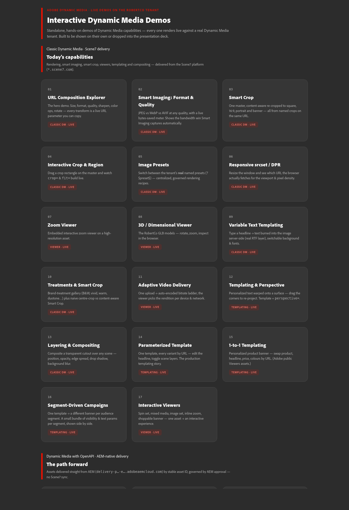
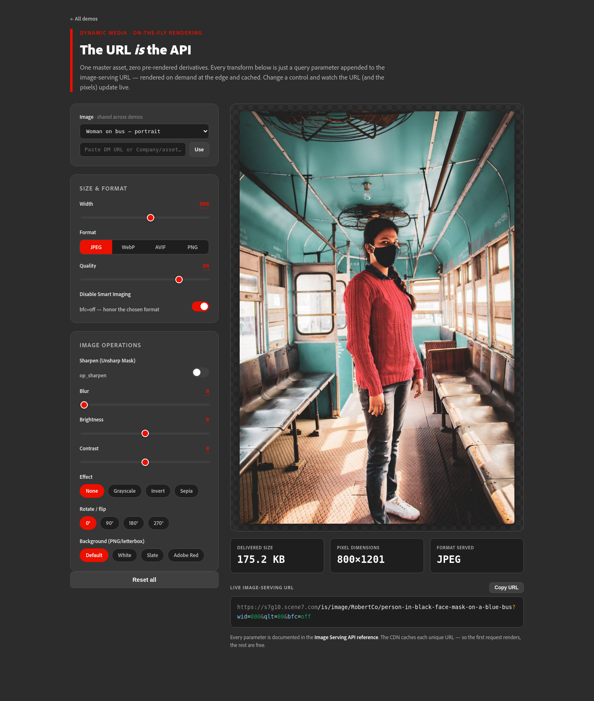
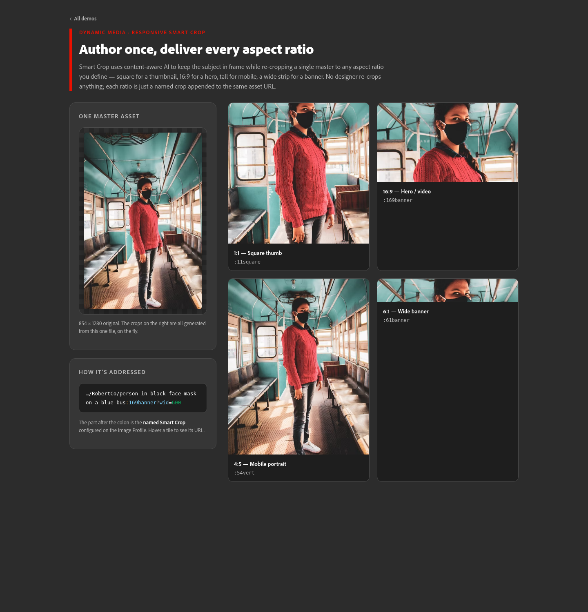
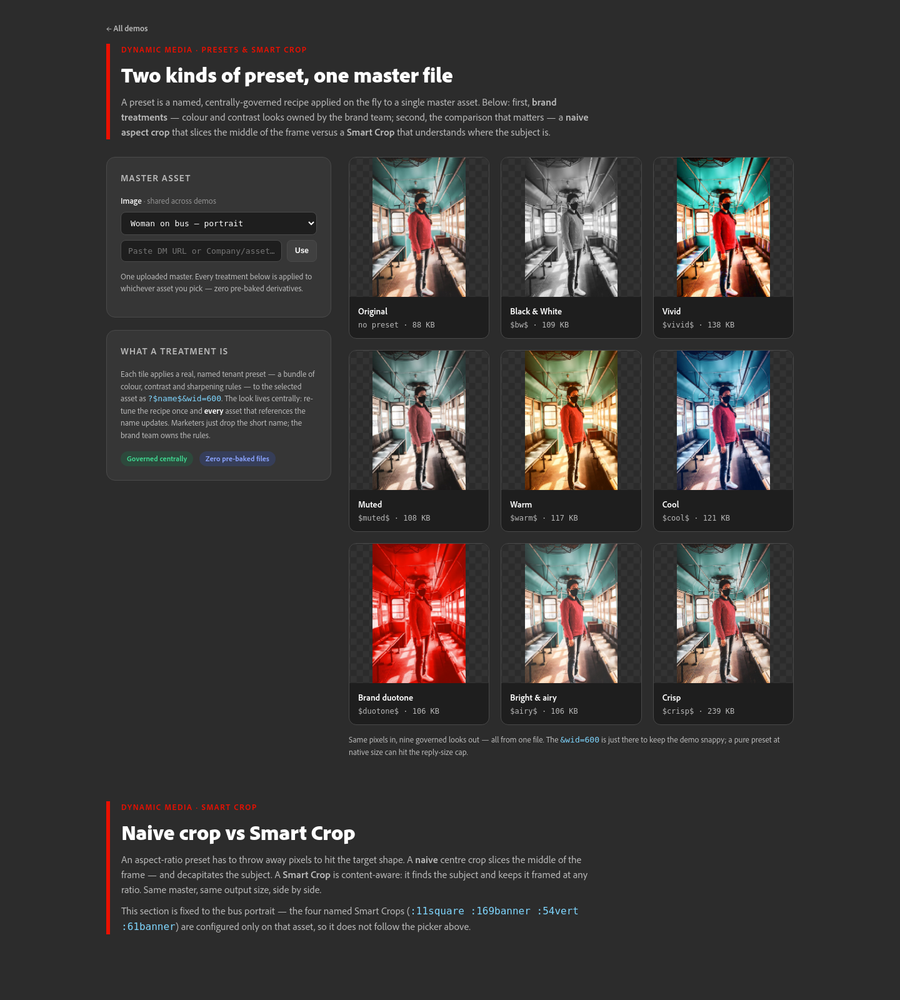
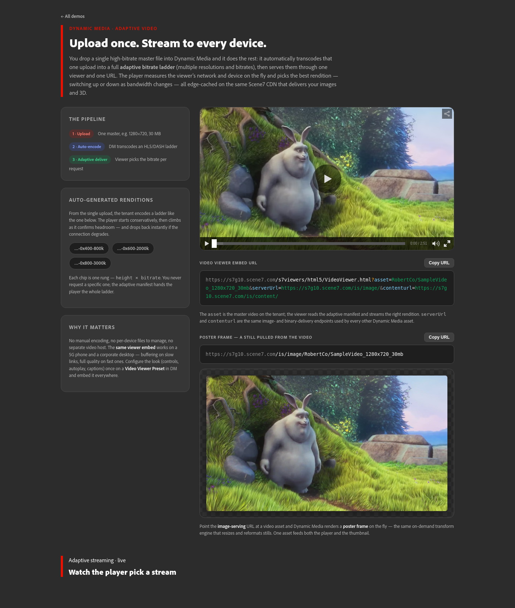

# Interactive Dynamic Media Demos

A set of **standalone, hands-on HTML demos** of Adobe Dynamic Media capabilities —
Dynamic Media Classic (Scene7 delivery) and Dynamic Media with OpenAPI (DMoAPI).
Every demo is a single self-contained page with no build step: each one renders
**live** by composing real delivery URLs and showing you the URL it built.

Each page is designed to be shown on its own or dropped into a slide deck via an `<iframe>`.



## What's inside

24 demos, grouped by capability. The number is the gallery position; the link is the file.

### Classic Dynamic Media — Scene7 delivery
| # | Demo | What it shows |
|---|------|---------------|
| 01 | [URL Composition Explorer](01-url-composition.html) | The hero demo. Size, format, quality, sharpen, colour ops, rotate — every transform is a live URL parameter you can copy. |
| 02 | [Smart Imaging: Format & Quality](02-format-quality.html) | JPEG vs WebP vs AVIF at any quality, with a live bytes-saved meter — the bandwidth win Smart Imaging captures automatically. |
| 03 | [Smart Crop](03-smart-crop.html) | One master, content-aware re-cropped to square, 16:9, portrait and banner — all from named crops on the same URL. |
| 04 | [Interactive Crop & Region](04-crop-region.html) | Drag a crop rectangle on the master and watch `crop=` & `fit=` build live. |
| 05 | [Image Presets](05-image-presets.html) | Switch between the tenant's real named presets (`?$preset$`) — centralized, governed rendering recipes. |
| 06 | [Responsive srcset / DPR](06-responsive-dpr.html) | Resize the window and see which URL the browser actually fetches for the viewport & pixel density. |
| 09 | [Variable Text Templating](09-text-templating.html) | Type a headline → text burned into the image server-side (real RTF layer), switchable background & fonts. |
| 10 | [Treatments & Smart Crop](11-preset-gallery.html) | Brand-treatment gallery (B&W, vivid, warm, duotone…) plus naive centre-crop vs content-aware Smart Crop. |
| 13 | [Layering & Compositing](14-compositing.html) | Composite a transparent cutout over any scene — position, opacity, edge spread, drop shadow, background blur. |

### Viewers
| # | Demo | What it shows |
|---|------|---------------|
| 07 | [Zoom Viewer](07-zoom-viewer.html) | Embedded interactive zoom viewer on a high-resolution asset. |
| 08 | [3D / Dimensional Viewer](08-dimensional-3d.html) | GLB models — rotate, zoom, inspect in the browser. |
| 11 | [Adaptive Video Delivery](12-video.html) | One upload → auto-encoded bitrate ladder; the viewer picks the rendition per device & network. |
| 17 | [Interactive Viewers](17-viewers.html) | Spin set, mixed media, image set, inline zoom, shoppable banner — one asset → an interactive experience. |

### Templating
| # | Demo | What it shows |
|---|------|---------------|
| 12 | [Templating & Perspective](13-perspective.html) | Personalized text warped onto a surface — drag the corners to re-project. Template + `perspective=`. |
| 14 | [Parameterized Template](15-template-params.html) | One template, every variant by URL — edit the headline, toggle scene layers. The production templating story. |
| 15 | [1-to-1 Templating](16-one-to-one.html) | Personalized product banner — swap product, headline, price, colours by URL. |
| 16 | [Segment-Driven Campaigns](22-campaign-segments.html) | One template → a different banner per audience segment, shown side by side. |

### Dynamic Media with OpenAPI (DMoAPI)
| # | Demo | What it shows |
|---|------|---------------|
| 18 | [Classic vs DMoAPI](10-classic-vs-dmoapi.html) | The bridge: what each one is, and the same master delivered both ways side by side. |
| 19 | [Approval-gated delivery](18-approval-gated.html) | Governance in action: unapproved assets 404; approve in AEM and they go live. |
| 20 | [Stable, rename-safe asset ID](19-stable-id.html) | The `urn:aaid:aem:<uuid>` never changes — rename or move the asset and the delivery URL still resolves. |
| 21 | [Asset metadata API](20-metadata-api.html) | Fetch the asset's metadata as JSON over the OpenAPI — the headless / Content-Hub integration story. |
| 22 | [Web-optimized delivery](21-web-optimized.html) | AEM-native `as/` renditions with width/quality/format negotiation from one governed asset. |
| 23 | [Capability parity](23-capability-parity.html) | Same master, both tiers, live: which transforms transfer 1:1 and which stay Classic-only. |
| 24 | [Asset Selector → any app](24-asset-selector.html) | Embed Adobe's Asset Selector micro-frontend, pick an approved asset, get its stable delivery URL back. (Needs Adobe sign-in.) |

## Selected screenshots

| URL Composition Explorer | Smart Crop |
|---|---|
|  |  |
| **Treatments & Smart Crop** | **Adaptive Video** |
|  |  |

## Running locally

No build step. Serve the folder over HTTP (some demos use `fetch`, so `file://` won't work for those):

```bash
./serve.sh                 # http://localhost:3336/
# or pick a port:
./serve.sh 8080
# or directly:
python3 serve.py 3336
# or any static server, e.g.:
npx serve .
```

Then open `http://localhost:3336/` and click into any demo. `serve.py` is a tiny
no-redirect static server that also resolves extensionless URLs to `.html`.

## How the live rendering works

- **Classic Dynamic Media demos** render out of the box against a **public Scene7
  sample tenant** (`RobertCo` on `s7g10.scene7.com`). These are public CDN delivery
  URLs, so the images load with no setup.
- **DMoAPI demos** also render live against a **public DMoAPI delivery tenant**.
  DMoAPI delivery URLs are public for *approved* assets (the same governance model:
  only approved + published assets are served), so these load with no setup too.
- **Exception — the Asset Selector (demo 24)** needs an Adobe **IMS sign-in** (it
  embeds Adobe's authenticated micro-frontend), so it can't render anonymously; it
  shows a sign-in prompt and a paste-a-token fallback. The *author* host it
  references is left as a placeholder (`author-pXXXXX-eYYYYYY`) since that tier is
  login-gated, not public.

### Point a demo at your own assets
Most demos include an **image picker** (top of the page) where you can paste a full
Dynamic Media image URL, a `Company/asset` pair, or a bare asset name. The selection
is remembered across demos via `localStorage`.

## The approval helper (optional)

`flip-approval.sh` flips a DMoAPI asset's Review Status (approve / unapprove) and
publishes it, which is what makes demo 19 (approval-gated delivery) toggle live. It
reads credentials from a local `.env`:

```bash
cp .env.example .env     # then fill in your AEM author host + user/password + delivery host
./flip-approval.sh approve   whistler-1
./flip-approval.sh unapprove whistler-1
```

`.env` is gitignored — never commit credentials.

## Notes

- **Fonts:** the demos use the system UI font stack. Adobe Clean is a licensed Adobe
  font and is intentionally not bundled here.
- These are **independent demos for learning and demonstration**, not an official
  Adobe product, and are not affiliated with or endorsed by Adobe. "Dynamic Media",
  "Scene7" and "AEM" are Adobe products/trademarks.
- The `RobertCo` Scene7 tenant is a public sample tenant used only so the Classic
  demos render without setup; it holds sample/demo imagery.
